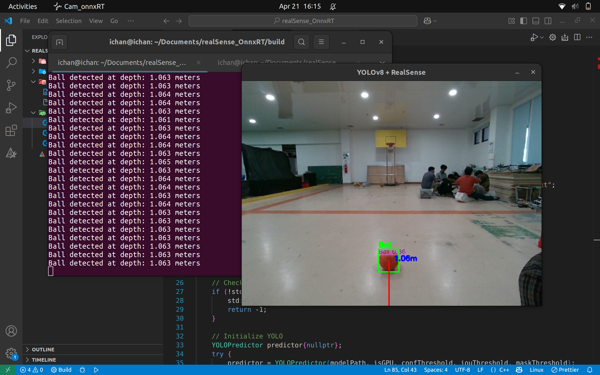

## 🚀 Getting Started
### 🛠️ Prerequisites

Before you can run the project, you'll need to install a few dependencies and set up your environment.

#### ✅ 1. Install OpenCV with Contrib Modules (C++)

OpenCV will be used for image processing and object detection tasks

    # Step 1: Install dependencies
    sudo apt update && sudo apt install -y cmake g++ libgtk-3-dev libtbb-dev
    
    # Step 2: Clone OpenCV and Contrib Modules
    cd ~
    git clone https://github.com/opencv/opencv.git
    git clone https://github.com/opencv/opencv_contrib.git
    
    # Step 3: Build and Install OpenCV
    cd opencv && mkdir build && cd build
    cmake -D CMAKE_BUILD_TYPE=Release \
          -D CMAKE_INSTALL_PREFIX=/usr/local \
          -D OPENCV_EXTRA_MODULES_PATH=~/opencv_contrib/modules ..
    make -j$(nproc)     
    sudo make install
    pkg-config --modversion opencv4

#### ✅ 2. Install Intel RealSense SDK

To interact with the RealSense camera, you will need to install the RealSense SDK. Follow the official guide for your platform:

👉 Intel RealSense SDK Installation Guide

#### ✅ 3. Install ONNX Runtime

ONNX Runtime is used to run the YOLO model in an optimized manner.

    # Step 1: Install ONNX Runtime dependencies
    sudo apt install -y libonnxruntime-dev
    
    # Step 2: Install ONNX Runtime (optional, Python version)
    pip install onnxruntime

#### ✅ 4. Download YOLO ONNX Model

Download a YOLO model in ONNX format (e.g., YOLOv5, YOLOv7, or YOLOv8). Pre-trained models are available on YOLOv5 GitHub.

Place the ONNX model file in the models/ directory of this project.

### ⚙️ Build and Run

    # Step 1: Clone this repository
    git clone https://github.com/ichsanyudika/realsense_ort.git
    
    # Step 2: Build the application
    cd realsense_ort
    mkdir build && cd build
    cmake ..
    make
    
    # Step 3: Run the application
    ./cam

#### 📸 **Results**

 
